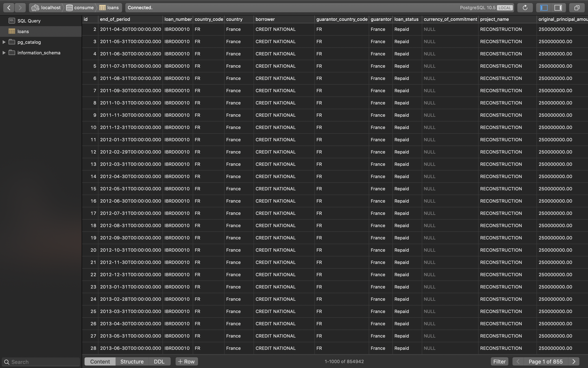

# consume
Consumes a specific dataset on a monthly basis.

## Key tools used
### [Anaconda Navigator](https://www.anaconda.com/distribution/)
```he open-source Anaconda Distribution is the easiest way to perform Python/R data science and machine learning on Linux, Windows, and Mac OS X.```

### [Postgres](https://www.postgresql.org/download/)
```The core of the PostgreSQL object-relational database management system is available in several source and binary formats.```

### [Jupiter](https://jupyter.org/)
```JupyterLab is a web-based interactive development environment for Jupyter notebooks, code, and data. JupyterLab is flexible: configure and arrange the user interface to support a wide range of workflows in data science, scientific computing, and machine learning```

### [Pandas](https://pandas.pydata.org/)
```pandas is an open source, BSD-licensed library providing high-performance, easy-to-use data structures and data analysis tools for the Python programming language.```

### [Postico](https://eggerapps.at/postico/)
```Postico will look familiar to anyone who has used a Mac before. Just connect to a database and begin working with tables and views. ```

## Usage
### Clone consume with this command to your laptop
> ```git clone https://github.com/AmosWels/consume-backend.git```

### Create your new database tables using the commands below;

```
CREATE TABLE loans (
    id SERIAL PRIMARY KEY,
    end_of_period text,
    loan_number text,
    country_code text,
    country text,
    borrower text,
    guarantor_country_code text,
    guarantor text,
    loan_status text,
    currency_of_commitment text,
    "project_name " text,
    original_principal_amount text,
    cancelled_amount text,
    undisbursed_amount text,
    disbursed_amount text,
    due_to_ibrd text,
    exchange_adjustment text,
    borrower_obligation text,
    sold_3rd_party text,
    repaid_3rd_party text,
    due_3rd_party text,
    loans_held text,
    first_repayment_date text,
    last_repayment_date text,
    agreement_signing_date text,
    board_approval_date text,
    effective_date text,
    closed_date text,
    last_disbursement_date text,
    loan_type text,
    region text,
    interest_rate text,
    project_id text,
    repaid_to_ibrd text
);
CREATE UNIQUE INDEX loans_pkey ON loans(id int4_ops); 
```
### Import cv data
Open Postico and right click on the loans table. Click mport the csv file into the table and much the columns accordingly. The table should look as shown below;



### Perform visualizations with Jupiter
Launch Jupiter and navigate to the file directory where you cloned the code. Open ```insertion.ipynb```
Execute each of the commands sequentially. 

Notice that after you've queried all the data with this command;
```
country_data= pd.read_sql_query('''SELECT * FROM loans;''',cnx)
country_data.head()
```
You can then visualize your data as you wish. Refer to the Gif below.


